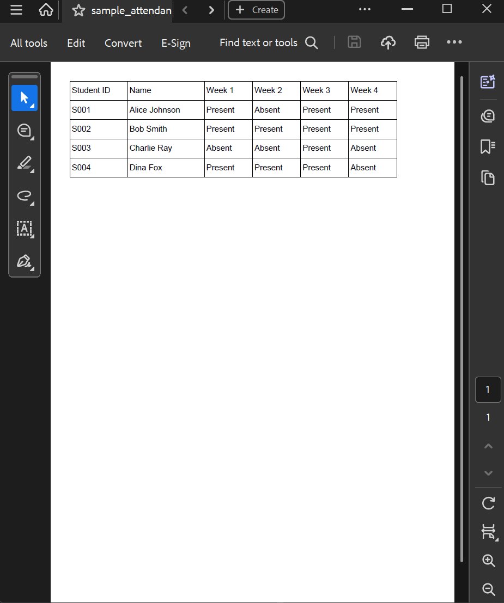
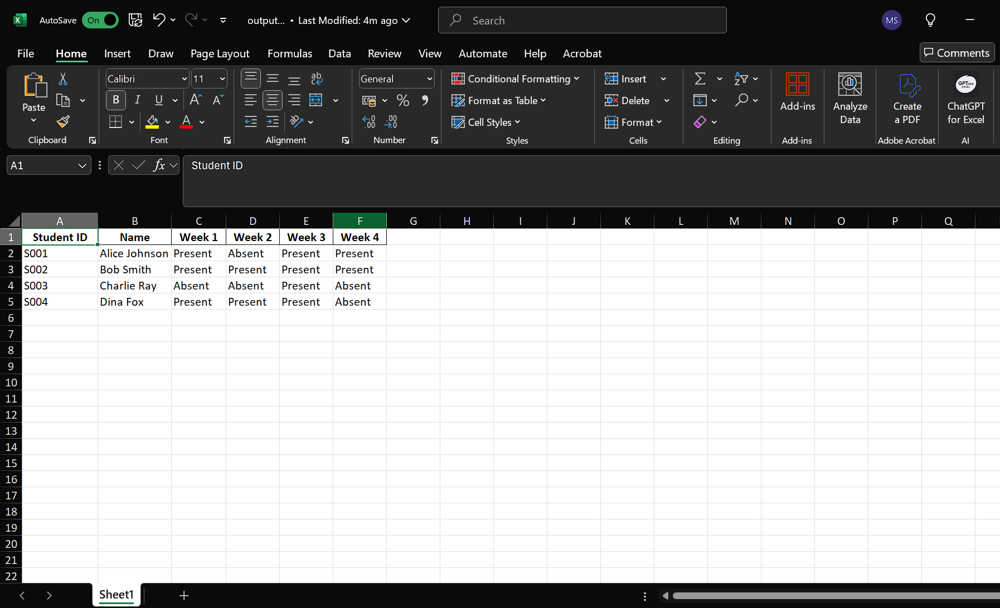

# 🧾 PDF to Excel Converter (Python)

This simple Python tool converts tables in PDF files into clean Excel spreadsheets using `pdfplumber` and `pandas`.

## 📌 Features
- Works with PDFs containing tables (e.g. attendance sheets, reports)
- Converts directly to Excel (.xlsx)
- Easy to use from your terminal or command line

## 🔧 How to Use

1. Install requirements:
pip install -r requirements.txt

2. Run the script:
python main.py

3. Enter your PDF file path and desired output Excel file name.

## 🖼️ Example (Before & After)

| Input PDF | Output Excel |
|-----------|--------------|
|  |  |

## 📬 Want a custom version?
Contact me if you’d like to:
- Add filters (e.g., only extract certain pages)
- Support Arabic or RTL text
- Build a version for your reports/grades

DM me in linkedin **
<a class="badge-base__link LI-simple-link" href="https://ae.linkedin.com/in/mohammed-siraj-905a70287?trk=profile-badge">Mohammed Siraj</a>
**

              